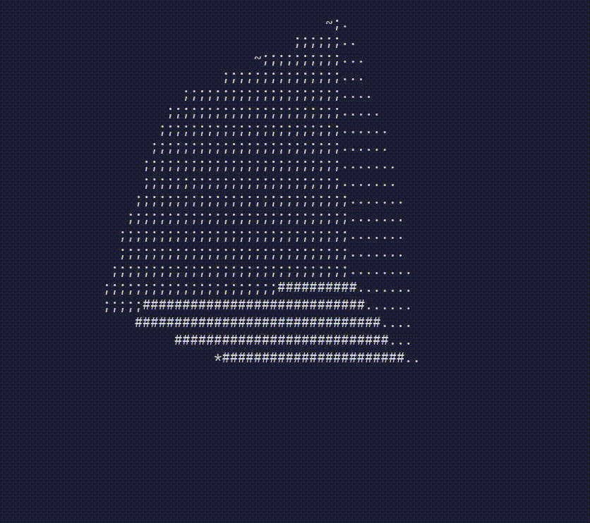
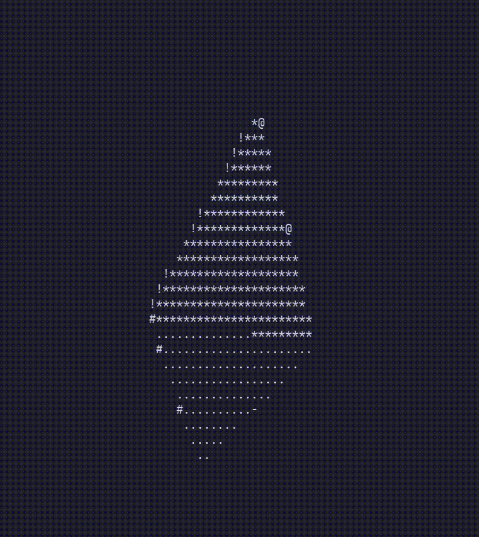
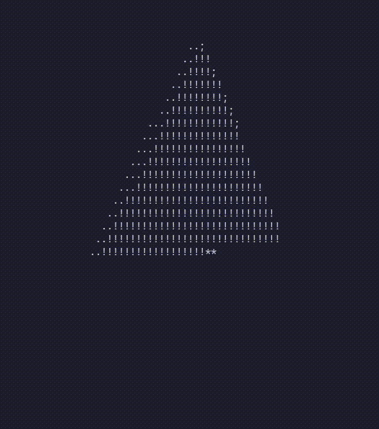

# 3D Shapes Render

This project renders various 3D shapes in the terminal.

## Cube

## Octahedron

## Pyramid

## Torus

The torus is rendered using a luminance calculation to create a more realistic lighting effect. The luminance is calculated based on the dot product of the surface normal and the light source direction. This creates a shading effect that makes the torus appear more three-dimensional.

